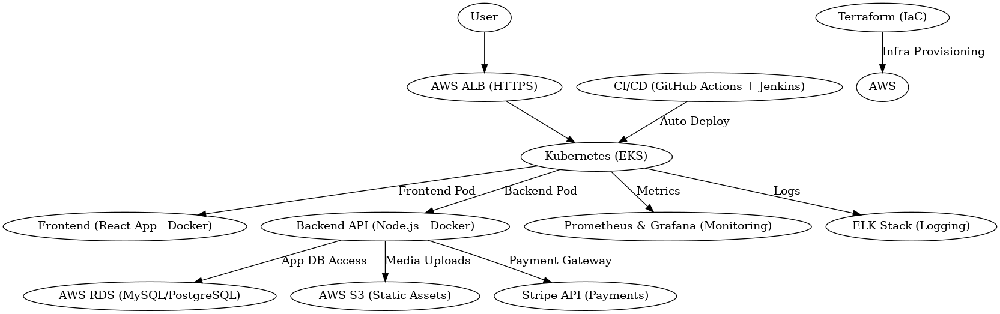

# TurfNow – Online Turf Booking Platform (DevOps Project)

An end-to-end DevOps implementation for **TurfNow**, a React + Node.js-based online turf booking platform. The project includes full cloud infrastructure automation, CI/CD pipelines, observability, and secure deployment on AWS using Kubernetes.

## 🔧 Tech Stack
- **Cloud**: AWS (EC2, RDS, S3, IAM, VPC, ALB)
- **IaC**: Terraform, Helm, Kubernetes (EKS)
- **CI/CD**: GitHub Actions, Jenkins
- **Containerization**: Docker, Kubernetes
- **Monitoring**: Prometheus, Grafana
- **Logging**: ELK Stack (Elasticsearch, Logstash, Kibana)
- **Security**: IAM, TLS/SSL, Secrets Management
- **Payments**: Stripe API
- **Frontend**: React
- **Backend**: Node.js (Express)

## 🧱 Architecture Diagram



## 🚀 Features Implemented

✅ Infrastructure as Code using **Terraform**  
✅ Dockerized frontend and backend apps  
✅ Kubernetes deployment on **AWS EKS**  
✅ **CI/CD pipelines** with GitHub Actions & Jenkins  
✅ Application load balancing with **ALB + TLS (HTTPS)**  
✅ **Stripe payment gateway** integration  
✅ **Prometheus + Grafana** for metrics and alerting  
✅ Centralized logging using **ELK Stack**  
✅ Secure configuration using **IAM, Secrets, and RBAC**  
✅ Daily automated **backups using Lambda**

## 🧪 CI/CD Pipelines
- GitHub Actions for code linting, test, Docker image build
- Jenkins pipeline for multi-stage deploy to EKS
- Slack/email notifications on build & deploy status

## 📦 Project Structure
```bash
.
├── terraform/              # Infrastructure as Code
├── helm-charts/            # Helm templates for EKS deployment
├── frontend/               # React app source code
├── backend/                # Node.js (Express) API
├── .github/workflows/      # GitHub Actions CI/CD YAMLs
├── jenkins/                # Jenkinsfile and pipeline configs
└── README.md               # Project overview
```

## 📈 Observability Snapshots
Add screenshots of:
- Grafana dashboard (CPU/Memory)
- ELK logs (bookings, payments)

## 📂 GitHub Repository

🔗 [Insert your GitHub repo link here]
